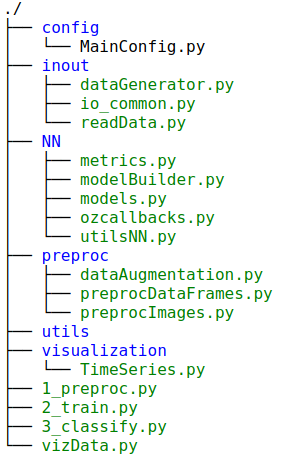

Keras Template
----------------

The objective of this template is to provide an initial code when
developing a new Deep Learning project and a suggestion in how to separate
the modules, configuration, files etc. The current template contains
the following files:

 

